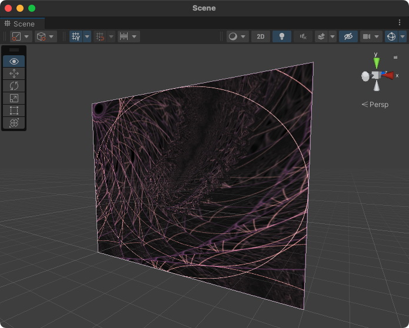

# Milkstain
Implementation of Milkdrop Visualizer in Unity. Based on <a href=https://github.com/jberg/butterchurn>Butterchurn</a>.



## Usage

### Requirements
Milkstain can be driven from any ```AudioSource``` as long as ```AudioClip``` is not compressed. Otherwise the time array will be filled with zeros.

Milkstain requires it's own unique layer for isolated rendering. It's set up by default to use the last layer slot.

### Playing presets
For visualizer to work, first you need to instantiate the prefab ```Assets/Milkstain/Resources/Milkdrop.prefab```. It has everything already set up.

Next, pass your ```AudioSource``` to ```TargetAudio``` field. To use external audio you can use microphone capture provided by Unity: <a href="https://docs.unity3d.com/ScriptReference/Microphone.Start.html">Microphone.Start</a>

Then call ```Initialize()```.

After these steps, ```FinalTexture``` can be grabbed and passed to your desired display location.

Every preset is stored as a ```TextAsset``` in ```PresetFiles``` array. It will automatically pick one of them every 15 seconds. Time can be adjusted in ```ChangePresetIn``` field. To manually switch the preset call ```PlayPreset(index, transitionDuration)``` for a specific pick or ```PlayRandomPreset(transitionDuration)``` to let it pick the next preset automatically.

Usage example is included into the project.

## Limitations
Unity requires shaders to be precompiled in editor so presets for Milkdrop 2.0 with custom Warp and Comp shaders will need to be precompiled in editor. There is experimental support for such presets, however to make them work you need to do these steps:

- Open Window -> Milkdrop Shader Compiler and press "Compile All Shaders" button.

- Open ```Assets/Milkstain/Resources/Milkdrop.prefab``` and assign created shaders from ```/Custom/``` folders to "Preset Warp Shaders" and "Preset Comp Shaders".

- Untick "Skip Custom Shaded" at the bottom.

I wrote this port for a small throwaway easter egg in my own project, so it might be inaccurate or contain bugs!
